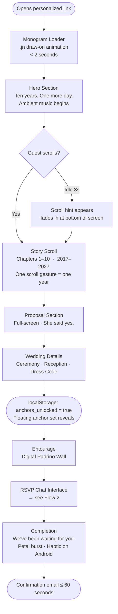
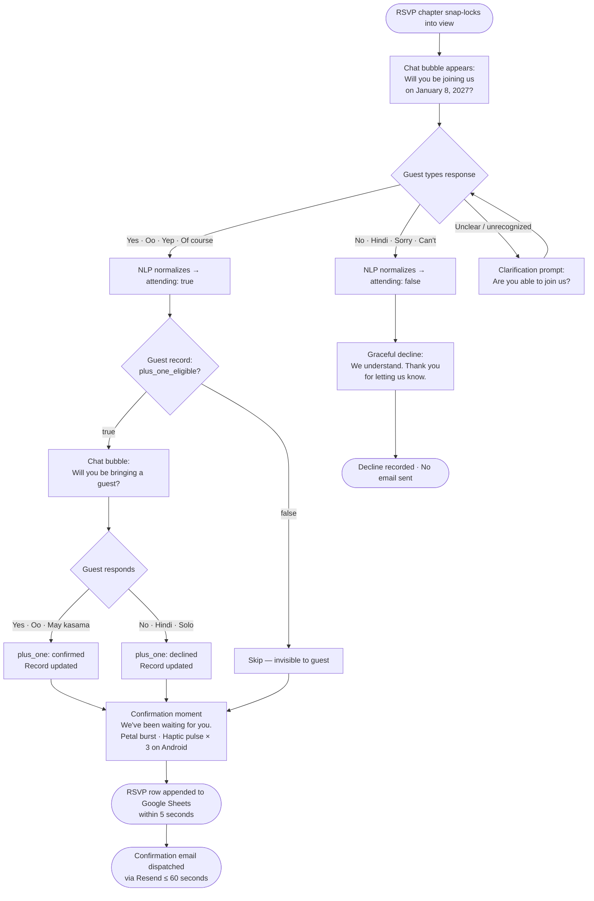
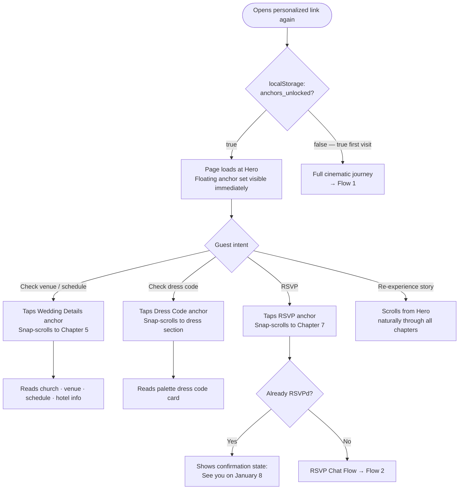
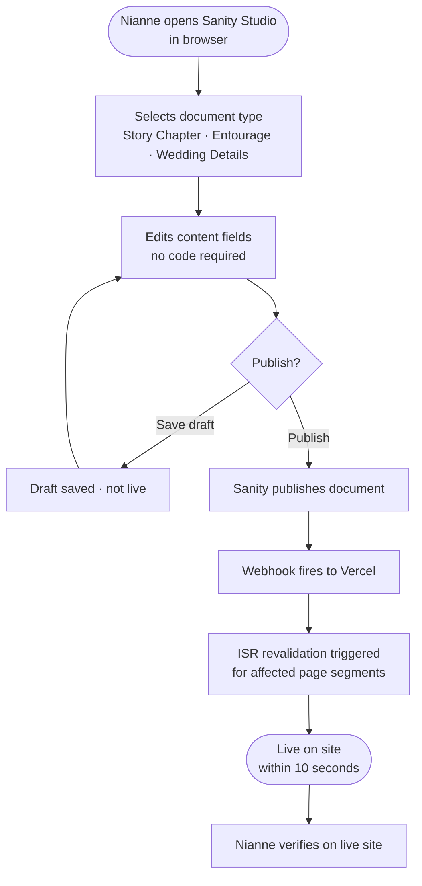

# UX Design Specification nijao-wedding-2027

**Author:** Javej
**Date:** 2026-04-03

---

<!-- UX design content will be appended sequentially through collaborative workflow steps -->

## Executive Summary

### Project Vision

Nijao Wedding 2027 is a single-page, scroll-locked wedding website where the interaction architecture is the emotional experience. The scroll metaphor — walking down the aisle at Casa 10 22 — is not a design layer on top of content; it IS the content. Every UX decision flows from one constraint: guests don't browse, they attend. The guiding hospitality north star is Aman Resorts: every guest should feel genuinely welcomed, not processed.

### Target Users

| User | Device | Context | Primary Need |
|---|---|---|---|
| **Ate Karen** (local guest) | Samsung Galaxy mid-range, Android | Opens via Viber group, commuting | Emotional experience + frictionless RSVP |
| **Kuya Mark** (diaspora guest) | Desktop + mobile | Home, evening; flying in for the wedding | Logistics clarity (venue, hotel, itinerary) |
| **Tita Cora** (senior family) | iPhone SE | Sent link by family member | Simple, unfailable path to RSVP |
| **Nianne** (admin / content owner) | Desktop browser | Sanity Studio, self-managed updates | Publish content confidently without code |

### Key Design Challenges

1. **The no-navigation tension** — The scroll-only architecture is the product. But return visitors need quick access to Wedding Details, Dress Code, and RSVP. The floating anchor set (progressive disclosure after first scroll-through, state in `localStorage`) resolves this — but its visual treatment must never read as a nav menu quietly reinstated.

2. **Conversational RSVP tone** — The chat-bubble interface must feel warm, not gimmicky. Prompt language, natural-language response tolerance ("oo" = yes), and the conditional plus-one flow (eligibility-gated per guest) all require precise UX writing and flow design.

3. **iOS audio autoplay** — Music is the first emotional signal, but Safari blocks autoplay. The tap-to-unmute affordance must feel like part of the ceremony — not a browser permission prompt.

4. **Monogram loader timing** — The `.jn` draw-on must complete in < 2 seconds. The animation pacing is the first UX judgment every guest makes. Too fast feels cheap; too slow feels broken.

### Design Opportunities

1. **Palette-as-wayfinding as a full design system** — 8 named colors with entourage associations (Deep Matcha, Raspberry, Golden Matcha, Strawberry Jam, Matcha Chiffon, Berry Meringue, Matcha Latte, Strawberry Milk) define section identity, accent colors, and role assignments. The UX spec will define exactly which color maps to which section and why.

2. **The RSVP confirmation as a designed moment** — *"We've been waiting for you"* is the most emotionally potent interaction in the product. The petal burst, haptic confirmation (Android), and chat message reveal deserve the same design attention as the hero section.

3. **Scroll chapter pacing** — Each chapter snap-locks into place. How each year of the story animates in — fade, slide, reveal — defines the cinematic quality the entire product depends on.

## Core User Experience

### Defining Experience

The scroll is the product. The primary user action is moving through the site in order — from the `.jn` monogram drawing itself, through the 10-year love story, to *"We've been waiting for you."* The RSVP is the destination, but the walk is the experience. No other action takes precedence over the linear cinematic journey on first visit.

### Platform Strategy

| Platform | Priority | Interaction Model |
|---|---|---|
| Mobile web (Chrome Android + Safari iOS, latest 2) | P1 — primary | Touch-first; snap-scroll via touch, tap to unmute audio |
| Desktop web (Chrome + Safari, latest 2) | P2 — diaspora guests | Mouse/keyboard enhancement of the same experience |
| Offline functionality | Not required | — |

**Device capabilities leveraged:**
- Haptic feedback via `navigator.vibrate()` on Android (RSVP confirmation)
- `localStorage` for first-visit completion state (floating anchor reveal)
- Web Audio API with graceful iOS degradation (tap-to-unmute pattern)

### Effortless Interactions

| Interaction | What makes it effortless |
|---|---|
| Scrolling through chapters | Snap-lock handles the pacing — guest just scrolls, the site does the rest |
| RSVP submission | Conversational chat-bubble; natural language accepted; no form fields |
| Finding key details on return visits | Floating anchor set appears automatically after first scroll-through |
| Nianne publishing content | Sanity Studio in browser — edit, publish, live in < 10 seconds |

### Critical Success Moments

| Moment | Why it's make-or-break |
|---|---|
| First 10 seconds (monogram + music + overlay) | Sets the entire emotional register — slow or cheap here, nothing recovers |
| The Mt. Fuji chapter | Emotional climax of the story scroll; guests feel the weight of the love story |
| RSVP submission → *"We've been waiting for you"* | The most personal moment; transactional here = Aman promise broken |
| Nianne's first solo content publish | If she calls Jave for help, the admin layer has failed |

### Experience Principles

1. **The scroll is the ceremony** — No interaction breaks the linear walk on first visit. Navigation shortcuts appear only after the guest completes their first scroll-through.
2. **Hospitality over efficiency** — Every interaction feels designed for this specific guest. Generic = failure.
3. **Emotion before information** — The love story precedes wedding logistics. Guests earn the details by walking through the story.
4. **Invisible design** — Palette-as-wayfinding, snap-scroll, floating anchors — none should feel like UI. They should feel like the site.
5. **Graceful degradation, never graceless failure** — iOS audio, snap-scroll cross-browser, haptic feedback — each has a fallback that preserves dignity.

## Desired Emotional Response

### Primary Emotional Goals

**Primary:** *Anticipated* — every guest feels genuinely expected, not mass-blasted. The Aman north star in precise terms: the feeling when a hotel doorman opens the door before you reach it.

**Secondary:** *Belonging* — guests should feel this wedding needs them there, not merely that they were invited.

### Emotional Journey Mapping

| Stage | Desired Emotion | Anti-emotion to Avoid |
|---|---|---|
| First 10 seconds (monogram + music) | Wonder — "this is different" | Impatience — "why is this loading" |
| Walking the love story chapters | Quiet recognition — "this is real love" | Detachment — "nice but not for me" |
| Mt. Fuji proposal moment | Moved — "oh, that's beautiful" | Indifference |
| Wedding details section | Confidence — "I know exactly what to do" | Anxiety — "wait, what do I wear?" |
| RSVP submission | Warmth — "they're glad I'm coming" | Transaction — "response submitted" |
| Confirmation: *"We've been waiting for you"* | Belonging — "I matter to this wedding" | Formality |
| Return visit | Ease — "I know where everything is" | Frustration — "I have to scroll through all of this again?" |

### Micro-Emotions

- **Trust over skepticism** — Monogram, typography, and palette coherence must signal craft from frame one. A rushed aesthetic casts doubt on the wedding itself.
- **Delight over satisfaction** — Karen screenshots the confirmation and sends it to a friend. That's delight. Satisfaction is completing a form. The difference is the design.
- **Calm over excitement** — Cinematic slow-burn (Bridgerton, not TikTok). Restraint is the design language. No hype, no urgency, no notifications.
- **Belonging over connection** — Connection is social media. Belonging is deeper — guests feel the wedding is incomplete without them.

### Design Implications

| Emotion | UX Design Approach |
|---|---|
| Anticipated / belonging | Personalized links greet by name; arrival overlay; *"We've been waiting for you"* confirmation |
| Wonder | Monogram draw-on as ceremony; music before visuals; radical negative space |
| Quiet recognition | One image + one sentence per year — restraint lets the story breathe |
| Confidence | Dress code palette card; ceremony and reception details clear and unambiguous |
| Ease on return | Floating anchor set — progressive disclosure, never intrusive |
| Calm | No navigation menu; snap-scroll controls pacing; no urgency language anywhere |

### Emotional Design Principles

- **No generic moments** — *"Your response has been submitted"* is never acceptable. Every system message is written in the couple's voice.
- **Restraint is warmth** — Negative space, slow animations, and minimal copy create the conditions for guests to feel, not just read.
- **Never pressure** — No countdown in the RSVP flow, no "limited spots" language, no deadline urgency. This is an invitation, not a conversion funnel.
- **Aesthetic consistency = trust** — Off-palette UI elements, system fonts, or stock photography break the emotional contract immediately.

## UX Pattern Analysis & Inspiration

### Inspiring Products Analysis

**1. Aman Resorts (hospitality north star)**
Aman's physical experience translates to digital hospitality: anticipatory service, radical simplicity, and the feeling that everything was prepared specifically for you. The RSVP confirmation *"We've been waiting for you"* is Aman DNA applied to a form submission. The arrival overlay is the digital lobby.

*Key UX lessons:* Anticipate needs before users express them. Reduce friction to near-zero at every decision point. Never make a guest feel like a transaction.

**2. A24 Films (cinematic pacing and title card typography)**
A24's marketing — sparse, typographic, intentional silence — is the visual reference for the story scroll. Title cards use restraint as a storytelling device: one image, one line, hold. The inter-title card concept (*"Ten years earlier."*) comes directly from this.

*Key UX lessons:* Pacing is content. White space is breathing room for emotion. Typography carries narrative weight.

**3. Jacquemus / Bottega Veneta (luxury fashion editorial scroll)**
Fashion editorial sites treat every scroll position as a composed photograph. One product per screen. Trust the silence. The look book scroll pattern — one perfect image per screen — borrows this pacing directly.

*Key UX lessons:* Density is the enemy of luxury. Editorial pacing signals craftsmanship. Mobile-first editorial design requires deliberate touch interaction design.

**4. Japanese Zen design (negative space and wabi-sabi)**
Permission to use 70% negative space, to trust that what's absent is as expressive as what's present. The wabi-sabi imperfection detail signals the site is alive, not polished to sterility.

*Key UX lessons:* Maximum information density is the wrong goal for an emotional product. Restraint = confidence. Imperfection = humanity.

### Transferable UX Patterns

**Navigation Patterns:**
- **Scroll-as-navigation** (A24, Jacquemus) — no menu; position in content = position in narrative. Directly adopted as the chapter architecture.
- **Floating contextual anchors** (luxury hotel apps) — minimal persistent access to key sections without breaking the primary experience. Adapted as the progressive-disclosure floating anchor set.

**Interaction Patterns:**
- **Conversational RSVP** (WhatsApp, iMessage) — chat-bubble interface; guests already know how to use it. Adopted directly.
- **Monogram-as-loader** (luxury brand splash screens) — branded loading moments transform wait time into ceremony. Adopted: `.jn` draws itself stroke-by-stroke.
- **Haptic confirmation** (Apple Pay, Instagram like) — physical feedback as emotional punctuation. Adopted for RSVP submission on Android; gracefully absent on iOS.

**Visual Patterns:**
- **Section identity via color** (editorial magazines, Spotify) — each section has a dominant color creating visual memory without a navigation label. Adopted as palette-as-wayfinding.
- **One image + one caption per unit** (A24 campaign pages, editorial lookbooks) — the constraint forces quality. Directly adopted for love story chapters.

### Anti-Patterns to Avoid

| Anti-Pattern | Why | Source |
|---|---|---|
| Navigation menu | Breaks the aisle metaphor; invites browsing instead of attending | Every generic wedding site |
| Form-based RSVP | Transactional; signals the guest is a data point | Zola, The Knot, Withjoy |
| Auto-playing music without consent signal | Violates iOS policy; startles users; breaks trust immediately | Web audio conventions |
| Generic confirmation copy | Destroys the Aman moment at the most important interaction | All form-based systems |
| Dense text blocks in story sections | Kills cinematic pacing; guests skim, not read | Standard wedding site templates |
| Progress indicators in the RSVP chat | Makes RSVP feel like a survey, not a conversation | Survey tools (Typeform misuse) |
| Infinite scroll without snap-lock | Loses chapter structure; guests end up mid-story | Generic scroll implementations |

### Design Inspiration Strategy

**Adopt directly:**
- Aman hospitality voice in all system messages and confirmations
- A24 typographic restraint — one strong line per section; no decorative copy
- Snap-scroll chapter architecture from editorial scroll conventions
- Chat-bubble RSVP from messaging app conventions

**Adapt for this product:**
- Jacquemus editorial pacing → adapted for a 10-chapter love story (chapters require narrative momentum, not just visual stillness)
- Japanese negative space → warmed with the wedding palette; pure white-space minimalism would feel cold for a Filipino wedding

**Avoid entirely:**
- Wedding platform conventions (Zola/The Knot/Withjoy) — every convention from these platforms is an anti-pattern for this product
- Dashboard or app-style navigation — this is a story, not a tool

## Design System Foundation

### Design System Choice

**Custom design system built on Tailwind CSS + shadcn/ui primitives.**

Tailwind CSS is already in the confirmed tech stack. shadcn/ui provides accessible, unstyled component primitives (dialog, form, input, button) that are fully branded via Tailwind tokens — they inherit the design system rather than imposing one.

### Rationale for Selection

| Factor | Decision |
|---|---|
| Visual uniqueness | Full — no UI library aesthetic bleeds through; the site looks like the wedding palette, not a component library |
| Accessibility | shadcn/ui primitives are WCAG-compliant by default; meets NFR-A1 (WCAG 2.1 AA) with less custom work |
| Tech stack alignment | Tailwind is already decided; this extends the existing stack, not a new dependency |
| Team capability | Two developers with strong technical skills — custom design system is achievable |
| Timeline | Tailwind's utility-first approach is fast to build with once tokens are defined |

### Implementation Approach

Design tokens defined as CSS custom properties in Tailwind config, consumed everywhere via utility classes. No hardcoded hex values in components.

### Customization Strategy

**Design token structure:**

| Token Category | Tokens |
|---|---|
| **Colors** | `--color-deep-matcha` (#676930), `--color-raspberry` (#9c4051), `--color-golden-matcha` (#baaf2f), `--color-strawberry-jam` (#b55a64), `--color-matcha-chiffon` (#b2bf93), `--color-berry-meringue` (#c98d8e), `--color-matcha-latte` (#9fc768), `--color-strawberry-milk` (#e8bcbc) |
| **Typography** | `--font-display` (headline/monogram), `--font-body` (story text, RSVP chat) — self-hosted via `next/font` |
| **Spacing** | Tailwind default 4px base scale |
| **Animation** | `--duration-ceremony` (monogram draw-on), `--duration-chapter` (scroll transitions), `--duration-rsvp` (chat bubble reveal) |
| **Shadows** | `--shadow-card` (Padrino Wall cards), `--shadow-overlay` (arrival overlay), `--shadow-anchor` (floating anchor set) |

**Component strategy:**
- shadcn/ui primitives: form inputs, dialog/overlay, button — fully re-skinned via tokens
- Custom components: monogram loader, chapter scroll container, RSVP chat interface, Padrino Wall card, floating anchor set — built from scratch
- No third-party component library UI imposed anywhere in the guest-facing experience

## Core User Experience

### Defining Experience

**The Scroll.** The defining interaction is vertical scrolling through a snap-locked chapter sequence. No menu, no shortcuts, no decisions — guests move forward by scrolling forward, exactly as they would walk down an aisle. If we nail the scroll architecture (smooth snap-lock, correct chapter pacing, cinematic transitions), everything else in the experience follows.

*"Scroll to walk the aisle."* — the one-line description guests will use.

### User Mental Model

Guests arrive with one of two mental models:
- **"Wedding website"** — expects logistics: date, venue, RSVP form. Will be immediately disoriented by the monogram loader and ambient music. This disorientation is intentional — it resets expectations within the first 10 seconds.
- **"Link from Jave/Nianne"** — expects something personal. Ready to feel something. The monogram draw-on meets this expectation immediately.

The second mental model is the one to design for. The first is the one to lovingly disrupt.

**Where guests get confused with existing solutions:**
- Navigation menus with too many options — paralysis before they've seen anything
- RSVP forms that look like government paperwork
- Generic stock photography that feels like a hotel booking site

### Success Criteria

| Criterion | Signal |
|---|---|
| Guest completes first scroll-through without touching back button | Linear path is clear; no disorientation |
| Guest reaches RSVP without clicking anything except scrolling | Aisle metaphor holds end-to-end |
| Guest submits RSVP and receives confirmation within 60s | Full journey complete; Aman promise delivered |
| Guest screenshots or shares the site | Delight threshold crossed |
| Return visit: guest finds Wedding Details within 10 seconds | Floating anchor set working correctly |

### Novel UX Patterns

Each element is familiar in isolation — the novelty is in the combination:

| Pattern element | Familiar from | Novel combination |
|---|---|---|
| Vertical scroll | Every website | Combined with snap-lock + chapter narrative structure |
| Chat-bubble RSVP | WhatsApp, iMessage | Applied to wedding RSVP — context-switch creates delight |
| Monogram loading screen | Luxury brand splash pages | Extended into a ceremonial draw-on animation with music |
| Floating action buttons | Mobile apps (FAB pattern) | Delayed reveal after first scroll-through changes meaning entirely |
| Color-coded wayfinding | Editorial magazines, Spotify | Applied as invisible navigation — no labels, pure color |

**Teaching the novel parts:** Snap-lock teaches itself on first scroll. Tap-to-unmute uses a single subtle icon during the monogram draw-on. Floating anchors appear after first scroll-through — guests have already seen the sections they anchor to.

### Experience Mechanics

**The Full Guest Journey:**

**1. Initiation — Monogram Loader**
Guest taps personalized link → screen goes dark → `.jn` draws itself stroke by stroke (~1.5s) → single cello note begins (iOS: tap-to-unmute icon visible) → fade to hero

**2. Hero — First Chapter**
Full-screen venue image → *"Ten years. One more day."* fades in → arrival overlay: *"Welcome. We're so glad you're here."* (name visible for personalized links) → first scroll gesture snap-locks to Chapter 1

**3. Story Scroll — Chapters 1–10 (2017–2027)**
Each scroll gesture advances one chapter → image + one-sentence caption appears → left-edge accent color shifts per section (palette-as-wayfinding) → chapters build toward Mt. Fuji

**4. Proposal Section**
Full-screen section → blurred Fuji silhouette → *"She said yes."* + date → emotional climax; longer dwell time

**5. Wedding Details**
Ceremony block (church, date, time) → reception block (venue, address, time) → dress code (palette card) → floating anchor set activates after this section (`localStorage`)

**6. Entourage**
Digital Padrino Wall — palette color cards per ninong/ninang → full wedding party list

**7. RSVP**
Chat bubble: *"Will you be joining us on January 8?"* → guest types yes/no → conditional plus-one prompt (eligibility-gated) → *"We've been waiting for you."* → Android: three haptic pulses + petal burst; iOS: petal burst only

**8. Completion**
Confirmation email within 60 seconds → floating anchor set active on all return visits

## Visual Design Foundation

### Color System

**Brand Palette (CSS Custom Properties)**

All 8 palette colors defined as design tokens, each mapped to a chapter:

```css
:root {
  /* Chapter Accent Colors */
  --color-deep-matcha:      #676930; /* Chapter 1: Monogram Loader */
  --color-raspberry:        #9c4051; /* Chapter 2: Hero */
  --color-matcha-latte:     #9fc768; /* Chapter 3: Story Scroll */
  --color-strawberry-jam:   #b55a64; /* Chapter 4: Proposal */
  --color-matcha-chiffon:   #b2bf93; /* Chapter 5: Wedding Details */
  --color-berry-meringue:   #c98d8e; /* Chapter 6: Entourage */
  --color-golden-matcha:    #baaf2f; /* Chapter 7: RSVP */
  --color-strawberry-milk:  #e8bcbc; /* Chapter 8: Completion */

  /* Semantic Roles */
  --color-primary:          var(--color-raspberry);
  --color-primary-dark:     #7a3040;
  --color-accent-confirm:   var(--color-golden-matcha);
  --color-surface-warm:     var(--color-strawberry-milk);
  --color-surface-neutral:  var(--color-matcha-chiffon);
  --color-text-on-dark:     #ffffff;
  --color-text-on-light:    #1a1a1a;
  --color-background:       #faf9f6;
}
```

**Chapter → Color Mapping**

| Chapter | Section | Color | Hex | Semantic Role |
|---|---|---|---|---|
| 1 | Monogram Loader | Deep Matcha | `#676930` | Canvas; `.jn` stroke color |
| 2 | Hero | Raspberry | `#9c4051` | Primary CTA; "Ten years" emphasis |
| 3 | Story Scroll | Matcha Latte | `#9fc768` | Year-marker accents; timeline nodes |
| 4 | Proposal | Strawberry Jam | `#b55a64` | Peak moment highlight |
| 5 | Wedding Details | Matcha Chiffon | `#b2bf93` | Info card backgrounds; venue accent |
| 6 | Entourage | Berry Meringue | `#c98d8e` | Role labels; member card borders |
| 7 | RSVP | Golden Matcha | `#baaf2f` | Outgoing chat bubble; confirmed state |
| 8 | Completion | Strawberry Milk | `#e8bcbc` | Petal burst; "We've been waiting" card |

**Semantic Color Notes**

- Accent colors are used for chapter identity only — never as primary text color on a non-verified background
- `--color-primary` (Raspberry) is the single cross-chapter CTA color, ensuring buttons read consistently regardless of which chapter they appear in
- `--color-background` `#faf9f6` — warm off-white, avoids the clinical feel of pure white against organic palette hues

### Typography System

**Font Pairing**

| Role | Family | Weights | Rationale |
|---|---|---|---|
| Display | Cormorant Garamond | 300, 400, 600 | Cinematic editorial serif — matches the "film about us" aesthetic; renders beautifully at large sizes for hero headline and monogram draw-on |
| Body / UI | DM Sans | 400, 500 | Humanist sans-serif — warm and approachable; optimized for legibility at 16px in chat bubbles, logistics cards, RSVP prompts |

Both fonts self-hosted via `next/font` — zero layout shift, optimal LCP contribution.

**Type Scale (CSS Custom Properties)**

```css
:root {
  /* Display Scale — Cormorant Garamond */
  --text-display-2xl: clamp(4rem, 10vw, 8rem);    /* Monogram .jn */
  --text-display-xl:  clamp(2.5rem, 6vw, 5rem);   /* Hero headline */
  --text-display-lg:  clamp(1.75rem, 4vw, 3rem);  /* Chapter titles */
  --text-display-md:  clamp(1.25rem, 3vw, 2rem);  /* Section subheadings */

  /* Body Scale — DM Sans */
  --text-body-lg:  1.25rem;    /* 20px — Story narrative */
  --text-body-md:  1rem;       /* 16px — Standard UI text (minimum) */
  --text-body-sm:  0.875rem;   /* 14px — Captions, metadata */

  /* UI Scale — DM Sans */
  --text-ui-md:    1rem;       /* 16px — RSVP chat prompts */
  --text-ui-sm:    0.875rem;   /* 14px — Button labels, input */

  /* Line Heights */
  --leading-display: 1.1;    /* Tight for large display text */
  --leading-body:    1.6;    /* Comfortable for reading */
  --leading-ui:      1.4;    /* Balanced for interactive elements */
}
```

**Letter Spacing**

- Display headings: `-0.02em` (tighten at large sizes)
- Monogram at `--text-display-2xl`: `0.05em` (slight tracking for elegance)
- All-caps role labels (entourage): `0.1em`
- Body text: `0` (normal)

### Spacing & Layout Foundation

**Base Unit:** 4px (Tailwind default spacing scale)

**Chapter Layout**

Each chapter is a `100dvh` snap-scroll unit, content centered in a single column:

```css
:root {
  --chapter-padding-x:      clamp(1.5rem, 5vw, 4rem);  /* 24px → 64px */
  --chapter-padding-y:      clamp(2rem, 8vw, 5rem);    /* 32px → 80px */
  --content-max-width:      640px;    /* Mobile-first; centered on desktop */
  --content-reading-width:  540px;    /* Narrower for story narrative chapters */
  --card-padding:           1.5rem;   /* 24px */
  --card-radius:            0.75rem;  /* 12px */
  --gap-chapter-elements:   2rem;     /* 32px between content blocks */
}
```

**Grid Strategy**

- Single-column layout throughout (enforces the aisle-walk metaphor — no sidebars, no splits)
- Desktop (≥ 1024px): content centered at `max-width: 640px`, ambient palette-color wash in margins
- Entourage chapter exception: 2-column member card grid at ≥ 640px

**Breakpoints (Tailwind)**

| Token | px | Purpose |
|---|---|---|
| `sm` | 640px | Entourage grid shift; content-reading-width active |
| `md` | 768px | Wedding details card layout adjustments |
| `lg` | 1024px | Desktop ambient margin treatment |

**Floating Anchor Set**

- Fixed bottom-right: `bottom: 2rem; right: 1.5rem`
- Vertical stack of 3 (Wedding Details, Dress Code, RSVP)
- Default: `opacity: 0; pointer-events: none`
- Unlocked: `opacity: 1` after first full scroll-through (`localStorage: 'anchors_unlocked'`)
- Touch target: 44×44px minimum (each anchor button)

### Accessibility Considerations

All visual foundation decisions treat WCAG 2.1 AA compliance as a hard constraint, not a post-hoc check:

1. **Color contrast** — chapter accent colors assigned to roles only where contrast ratios are verified. White text (`#ffffff`) on Raspberry (`#9c4051`), Deep Matcha (`#676930`), and Strawberry Jam (`#b55a64`) all meet AA. Dark text (`#1a1a1a`) on Matcha Chiffon, Strawberry Milk, and Berry Meringue all meet AA. No accent color used as body text without a verified pairing.

2. **Font sizing** — minimum body text 16px (`--text-body-md`). No user-facing content under 14px. RSVP chat prompts: 16px, never truncated.

3. **Touch targets** — 44×44px minimum for all primary interactive elements (required for Tita Cora's iPhone SE, one-thumb use case). RSVP confirm button: full-width on mobile.

4. **Focus states** — all interactive elements receive a visible focus ring: `outline: 2px solid var(--color-raspberry); outline-offset: 2px`. Never suppressed without an equivalent custom indicator.

5. **Motion sensitivity** — all chapter animations wrapped in `prefers-reduced-motion`. Reduced-motion fallback: instant chapter transitions, static monogram (no draw-on), no petal burst.

6. **iOS audio autoplay** — tap-to-unmute is a designed first interaction, not a barrier. No content is inaccessible without audio. Music enhances; it does not carry meaning.

7. **Screen reader path** — each chapter is a semantic `<section aria-label="...">`. Scroll-snap degrades gracefully to standard vertical scroll for assistive technologies. RSVP chat uses `role="log"` with `aria-live="polite"` for message announcements.

## Design Direction Decision

### Design Directions Explored

Six directions were evaluated against the project's emotional goals, architecture constraints, and brand palette:

| Direction | Ground | Color Application | Character |
|---|---|---|---|
| A — Cinematic Dark | Near-black | Accent as chapter dominant hue | Dramatic, film |
| **B — Light Editorial** | Off-white | Sparse: rules, emphasis, UI only | **Refined, print-like** |
| C — Warm Organic | Cream/parchment | Type accents + UI only | Tactile, artisan |
| D — Full Bleed Color | Accent per chapter | Entire background shifts | Bold, joyful |
| E — Serif & Film | Black | White type + single accent | Auteur, typographic |
| F — Intimate & Close | Dark warm brown | Strawberry Milk/Jam palette | Private, photo-first |

### Chosen Direction

**Direction B — Light Editorial**

Near-white ground (`#faf9f6`) throughout all chapters. Palette accent colors used sparingly: for horizontal rules, typographic emphasis, UI element states, and chapter left-edge accents. The overall canvas stays consistently light; color appears as punctuation, not as wallpaper.

### Design Rationale

1. **Watercolor imagery compatibility** — The primary driver. Watercolor illustrations of the venue (Casa 10 22), the church, and surrounding Lipa environments need a light, neutral ground to read with full chromatic richness. A dark or color-saturated background would fight the illustration palette; off-white lets the watercolors breathe and own their luminosity.

2. **Palette as accent, not saturation** — The 8-color palette is bold and warm. On a light ground, each accent color reads with precision — a Raspberry rule on off-white is deliberate and jewel-like. On a dark or saturated ground, the same colors risk feeling muddy or lost.

3. **Print invitation translation** — The Light Editorial direction feels like a well-designed physical invitation rendered in screen form. This aligns with the Aman Resorts hospitality north star: gracious, considered, never shouting.

4. **Senior guest readability** — Dark text on light ground delivers the highest contrast ratios across all chapters, directly serving Tita Cora's readability needs without requiring special accessibility modes.

5. **"Ten years" narrative tone** — The story scroll (10 chapters, 2017–2027) benefits from a light, editorial canvas. Each year's moment is framed like a magazine spread — the story is foregrounded, not the interface.

### Implementation Approach

- **Global ground**: `--color-background: #faf9f6` applies to all `<body>` and chapter `<section>` elements
- **Chapter accent expression**: Each chapter's accent color appears on a 3–4px left-edge rule or as the chapter title color — not as the background
- **RSVP chapter exception**: The RSVP chapter (Golden Matcha) uses the accent color for outgoing chat bubbles and the confirmed state card — the first moment a full accent block appears, making it feel earned
- **Completion chapter**: Strawberry Milk `#e8bcbc` used as a full-bleed background for the final "We've been waiting for you" card only — the single full-color reveal at the emotional peak
- **Watercolor image treatment**: Images displayed with a subtle `mix-blend-mode: multiply` on a white surface layer, allowing illustration ink to integrate with the off-white canvas
- **Typography on light ground**: Cormorant Garamond display text in `#1a1a1a`; DM Sans body in `#1a1a1a`; Raspberry `#9c4051` for primary emphasis and CTAs

## User Journey Flows

### Flow 1 — Primary Guest Journey (First Visit)

*Applies to: Ate Karen (primary), all first-time guests*



### Flow 2 — RSVP Chat Interaction (Detailed)

*Applies to: all guests who reach Chapter 7*



### Flow 3 — Return Visit

*Applies to: Kuya Mark (primary), any guest who returns to check details*



### Flow 4 — Admin Content Update (Nianne)

*Applies to: Nianne as content owner*



### Journey Patterns

**Navigation Patterns**

- *Scroll-snap as primary navigation* — guests never choose where to go on first visit; the scroll sequence is the product
- *Floating anchor set as return shortcut* — 3 anchors (Wedding Details, Dress Code, RSVP) become available only after first full scroll-through; never feel like a menu reinstatement
- *Chapter left-edge accent* — palette color shifts per chapter provide passive wayfinding without any indicator chrome

**Decision Patterns**

- *NLP response normalization* — RSVP chat accepts Filipino casual variants ("oo", "oo naman", "andoon kami") and maps them to `attending: true` without re-prompting
- *Plus-one eligibility gate is invisible* — ineligible guests never encounter a "you can't bring a plus-one" prompt; the branch simply doesn't exist for them
- *Decline path is graceful, not transactional* — "We understand. Thank you for letting us know." closes the experience with warmth, not a form confirmation

**Feedback Patterns**

- *RSVP confirmation as designed moment* — petal burst + haptic (Android) + "We've been waiting for you" is the single highest-intensity feedback event in the product; all other feedback is subtle
- *Chapter transitions* — snap-lock is the feedback; no progress bar, no chapter count overlay
- *Admin publish* — webhook-to-live < 10s provides near-immediate feedback without a preview system

### Flow Optimization Principles

1. **Zero navigation decisions on first visit** — the scroll is the navigation; guests make no routing choices until the floating anchor set unlocks
2. **RSVP in ≤ 4 chat turns** — attending → (plus-one if eligible) → confirmation; never more than 5 turns including error recovery
3. **Return visit: target section reachable in 1 tap** — floating anchor set reduces any repeat-visit task to a single interaction
4. **Natural language tolerance removes the form feeling** — guests respond as they would in a Viber message, not a web form
5. **Plus-one gate never creates friction for ineligible guests** — the eligibility check is server-side and silent; no guest ever learns what they're not eligible for

## Component Strategy

### Design System Components

**Available from shadcn/ui (used as-is or lightly themed):**

| Component | Usage in nijao-wedding-2027 |
|---|---|
| `Button` | RSVP confirm, floating anchors, admin actions |
| `Input` / `Textarea` | RSVP chat text input field (secondary path) |
| `Card` | Base primitive for WeddingDetailCard, EntourageCard |
| `Badge` | Entourage role labels (Ninong, Ninang, Best Man, etc.) |
| `Skeleton` | Loading placeholder for story chapter images |
| `Sonner` (Toast) | Admin publish feedback; RSVP submission error states |
| `Separator` | Chapter dividers, information hierarchy |
| `Avatar` | Entourage member photos |

All shadcn/ui components re-themed to the Light Editorial direction: `--background: #faf9f6`, `--primary: #9c4051` (Raspberry), `--radius: 0.75rem`.

### Custom Components

#### `<MonogramLoader>`

**Purpose:** Full-screen opening animation that draws the `.jn` monogram stroke-by-stroke, setting the cinematic tone before any content is seen.

**Anatomy:** SVG path with `stroke-dashoffset` animation → monogram text fades in → subtitle ("Jave & Nianne · 2027") fades in → loader fades out, revealing Hero

**States:** `animating` → `complete` → `dismissed`

**Timing:** Total duration < 2 seconds. `prefers-reduced-motion`: skip directly to `dismissed`.

**Accessibility:** `aria-label="Loading — Jave and Nianne's wedding"`, `role="status"`; hidden from screen reader once dismissed

---

#### `<ChapterSection>`

**Purpose:** Layout primitive. Wraps each of the 8 wedding chapters into a `100dvh` snap-scroll unit with left-edge accent rule.

**Anatomy:** Full-viewport `<section>` + 3–4px left border in chapter accent color + centered content column (`max-width: 640px`)

**Props:** `accentColor`, `ariaLabel`, `chapterId`

**States:** `active` (current snap position) / `inactive`

**Accessibility:** `<section aria-label="...">` per chapter; scroll-snap degrades to normal scroll for assistive tech

---

#### `<StoryChapter>`

**Purpose:** Renders one year of the couple's story (Chapters 1–10 in the Story Scroll section).

**Anatomy:** Year number (display typography) + watercolor image (`mix-blend-mode: multiply`) + one-sentence caption + left timeline node (Matcha Latte accent dot)

**States:** `entering` (animates in on scroll snap) / `visible` / `exiting`

**Animation:** Image fade-up + caption fade-in, staggered 150ms. `prefers-reduced-motion`: instant reveal.

**Content:** Driven by Sanity CMS (`StoryChapterDocument` schema)

---

#### `<RSVPChat>`

**Purpose:** Container component for the conversational RSVP experience. Manages message history, quick-reply chips, text input, NLP normalization, and API calls to the RSVP endpoint.

**Anatomy:** Scrollable message list (`role="log"`, `aria-live="polite"`) + quick-reply chip row (appears below each binary prompt) + text input field (secondary path, always available) + send button

**States:** `idle` → `prompting` → `awaiting-response` → `processing` → `confirmed` / `declined` → `confirmed-return` (return visitors who already RSVPd)

**Interaction model (hybrid):**
- Quick-reply chips appear below each system prompt requiring a binary answer
- Tapping a chip populates and sends immediately — no separate submit
- Chips dismiss after selection; replaced by guest's chosen response as an outgoing bubble
- Text input remains active throughout; NLP normalization handles all typed variants
- Zero typing required for complete RSVP via chip path (primary for Tita Cora)

**Maximum turns:** 5 (chip path: 2 taps to confirmed; text path: ≤ 5 including error recovery)

**Accessibility:** `role="log"` on message container; `aria-live="polite"` for new messages; input has `aria-label="Type your RSVP response"`

---

#### `<ChatBubble>`

**Purpose:** Individual message bubble within RSVPChat. Three variants: system (incoming), guest response (outgoing), quick-reply chip set.

**Anatomy:** Message text + border-radius asymmetry (incoming: `16px 16px 16px 4px`; outgoing: `16px 16px 4px 16px`)

**Variants:**
- `incoming` — system/host voice; off-white background, dark text
- `outgoing` — guest response; Golden Matcha `#baaf2f` background, dark text
- `confirmation` — italicized; light Golden Matcha tint, Cormorant Garamond italic
- `quick-reply-set` — horizontal chip row beneath an incoming bubble; two outlined pill buttons in Raspberry `#9c4051`; on tap: fills solid, sends, dismisses row

**Quick-reply chip content:**
- Q1 (attending): *"Yes, I'll be there 🙌"* / *"Sorry, I can't make it"*
- Q2 (plus-one, eligible guests only): *"Yes, bringing a guest"* / *"Just me"*

**Touch target:** Chip height + padding ≥ 44px

**States:** `appearing` (slide-up + fade in) / `visible`

---

#### `<PetalBurst>`

**Purpose:** Full-screen petal/confetti animation triggered on RSVP confirmation.

**Anatomy:** Canvas overlay; petals in Raspberry, Strawberry Milk, Matcha Latte, Berry Meringue; gravity + drift; auto-dismisses after 3 seconds

**Platform:** Android: petal burst + `navigator.vibrate([80, 60, 80, 60, 80])`; iOS: petal burst only

**Accessibility:** `aria-hidden="true"`; `prefers-reduced-motion`: skip entirely

---

#### `<EntourageCard>`

**Purpose:** Displays one entourage member with photo, name, and role. Used in Chapter 6 (Padrino Wall).

**Anatomy:** Avatar + member name (DM Sans medium) + role badge (Berry Meringue accent) + optional couple association label

**Variants:** `principal` (padrinos — larger) / `party` (bridesmaids, groomsmen — standard)

**States:** `default` / `hover` (`translateY(-2px)` lift)

**Layout:** 2-column grid ≥ 640px; single column on mobile

**Content:** Driven by Sanity CMS

---

#### `<WeddingDetailCard>`

**Purpose:** Structured information block for ceremony, reception, or logistics. Used in Chapter 5.

**Anatomy:** Section icon (optional) + heading + detail lines (time, address, notes) + optional CTA ("Get Directions")

**Variants:** `ceremony`, `reception`, `hotel`, `dresscode`

**Left-edge accent:** 3px Matcha Chiffon `#b2bf93` border-left

**Content:** Driven by Sanity CMS

---

#### `<FloatingAnchorSet>`

**Purpose:** 3-button fixed navigation shortcut, revealed after first full scroll-through. Enables return navigation without reinstating a visible menu.

**Anatomy:** Vertical stack of 3 pill buttons, fixed bottom-right (`bottom: 2rem; right: 1.5rem`). Label visible on hover/focus only.

**Buttons:** Wedding Details (Matcha Chiffon) · Dress Code (Berry Meringue) · RSVP (Raspberry)

**States:**
- `locked` — `opacity: 0; pointer-events: none` (first visit, before full scroll-through)
- `unlocked` — `opacity: 1` after `localStorage: 'anchors_unlocked'`; persists on all return visits

**Touch target:** 44×44px minimum per button

**Accessibility:** `aria-label` per button; `aria-hidden="true"` in locked state

---

#### `<DressCodeCard>`

**Purpose:** Visual presentation of the wedding dress code using the palette as a style guide.

**Anatomy:** Section heading + color swatch row (palette colors representing acceptable attire) + written guidance + "What to avoid" note

---

#### `<TapToUnmute>`

**Purpose:** iOS-safe ambient music affordance. Presented as a designed arrival moment, not a browser permission prompt.

**Anatomy:** Quiet overlay at bottom of Hero: music note icon + "Tap to play music"

**Behavior:** Visible only on iOS/Safari; tap calls `audioElement.play()` and dismisses

**States:** `visible` (iOS, before tap) / `hidden` (all other platforms, or after tap)

**Accessibility:** `role="button"`, `aria-label="Play ambient wedding music"`

---

#### `<PersonalizedGreeting>`

**Purpose:** Quiet welcome message on personalized link open. Reads guest name from URL token.

**Anatomy:** Small pill: "Welcome, [First Name]" — fades in over Hero after loader; auto-dismisses after 3 seconds or on first scroll

**Variants:** Personalized (shows name) / Generic (hidden)

**Accessibility:** `aria-live="polite"` announcement; dismissed before focus moves to Hero

---

### Component Implementation Strategy

Build order follows token dependency:

```
shadcn/ui primitives (themed to Light Editorial)
    ↓
ChapterSection (layout primitive — everything depends on it)
    ↓
Content components (StoryChapter, EntourageCard, WeddingDetailCard, DressCodeCard)
    ↓
Interaction components (RSVPChat, ChatBubble, FloatingAnchorSet)
    ↓
Moment components (MonogramLoader, PetalBurst, TapToUnmute, PersonalizedGreeting)
```

No component references hardcoded hex values — all colors via CSS custom properties.

### Implementation Roadmap

**Phase 1 — Experience MVP** *(required before first guest link is sent)*

| Component | Critical For |
|---|---|
| `<MonogramLoader>` | First impression |
| `<ChapterSection>` | Layout primitive; all other chapters depend on it |
| `<StoryChapter>` | Core story scroll |
| `<TapToUnmute>` | iOS music; silent failure without it |
| `<WeddingDetailCard>` | Logistics — guests need this to attend |
| `<EntourageCard>` | Padrino Wall |
| `<RSVPChat>` + `<ChatBubble>` | Primary product goal: collect RSVPs |
| `<PetalBurst>` | RSVP confirmation moment |
| `<FloatingAnchorSet>` | Return visit navigation |

**Phase 2 — Polish**

| Component | Enhances |
|---|---|
| `<DressCodeCard>` | Wedding Details chapter |
| `<PersonalizedGreeting>` | Personalized link warmth on arrival |
| `<ConfirmationState>` | Return visitor RSVP status |

**Phase 3 — Enhancement** *(post-launch if needed)*

- Sanity Studio custom input types (palette color picker, entourage ordering)
- Admin RSVP summary dashboard view

## UX Consistency Patterns

### Button Hierarchy

Five button types used across the product, each with a specific role:

| Type | Visual | Usage |
|---|---|---|
| **Primary** | Raspberry `#9c4051` fill · white text · `border-radius: 0.75rem` | Single dominant CTA per screen (RSVP section) |
| **Secondary** | Raspberry outline · Raspberry text | Secondary actions alongside a primary |
| **Ghost** | No border · Raspberry text | Tertiary/text-link level actions |
| **Quick-reply chip** | Raspberry outline pill · fills solid on tap | RSVPChat binary prompts only |
| **Floating anchor** | Chapter accent fill · white icon · 44×44px min | FloatingAnchorSet navigation only |

**Rules:**
- Never more than one Primary button visible at a time within a chapter
- Quick-reply chips are not general-purpose buttons — they exist only inside `<RSVPChat>`
- Floating anchors never appear as general page CTAs — they are navigation shortcuts only
- All buttons: `focus-visible` ring `2px solid #9c4051, offset 2px`; never suppressed

### Animation & Transition Patterns

All animations defined as CSS custom properties alongside the existing duration tokens:

```css
:root {
  /* Existing tokens */
  --duration-ceremony:  400ms;   /* chapter content entrance */
  --duration-chapter:   600ms;   /* chapter snap-lock transition */
  --duration-rsvp:      300ms;   /* chat bubble appearance */

  /* Easing */
  --ease-enter:    cubic-bezier(0.0, 0.0, 0.2, 1);   /* decelerate — for entrances */
  --ease-exit:     cubic-bezier(0.4, 0.0, 1, 1);     /* accelerate — for exits */
  --ease-standard: cubic-bezier(0.4, 0.0, 0.2, 1);  /* standard — for state changes */
}
```

**Chapter content entrance:** `translateY(20px) → translateY(0)` + `opacity: 0 → 1`; 400ms `--ease-enter`; image first, caption +150ms stagger

**MonogramLoader draw-on:** SVG `stroke-dashoffset` from full length → 0; 1200ms `ease-in-out`; subtitle fades at 1000ms; full sequence < 2000ms

**Chat bubble appearance:** `translateY(8px) → translateY(0)` + `opacity: 0 → 1`; 300ms `--ease-enter`; chip row follows +200ms after bubble settles

**Quick-reply chip selection:** fill transition 150ms; chip row `opacity: 0` over 200ms after selection

**FloatingAnchorSet reveal:** `opacity: 0 → 1` over 400ms after `localStorage` flag set; anchor label expands on hover in 200ms

**PetalBurst:** 60+ petals; Raspberry, Strawberry Milk, Matcha Latte, Berry Meringue; gravity + random drift; 3000ms lifecycle

**`prefers-reduced-motion` fallback:**
```css
@media (prefers-reduced-motion: reduce) {
  *, *::before, *::after {
    animation-duration: 0.01ms !important;
    transition-duration: 0.01ms !important;
  }
}
```
Specific overrides: MonogramLoader shows static monogram; PetalBurst skipped entirely; chapter transitions instant.

### Feedback Patterns

**RSVP confirmation (peak moment):**
1. Outgoing response bubble appears
2. Typing indicator (three animated dots) in incoming position — 800ms
3. Confirmation bubble: *"We've been waiting for you."* (Cormorant Garamond italic, Golden Matcha tint)
4. PetalBurst overlay fires simultaneously
5. Android: `navigator.vibrate([80, 60, 80, 60, 80])` (three pulses)
6. Confirmation email dispatched — guest receives within 60 seconds

**RSVP processing state:** Input and chip row `disabled` + `opacity: 0.5` while API call in flight; typing indicator dots replace the next expected bubble; no spinner overlays — keep the chat metaphor intact

**RSVP network/API error:** Inline incoming bubble: *"Something went wrong — tap to try again"*; retry re-submits last response; after 3 failures: graceful degradation message with manual fallback note

**RSVP unrecognized response:** NLP normalization handles all known variants first; clarification re-prompt only if truly unrecognized (*"Are you able to join us?"* + chips reappear); maximum 1 re-prompt before simplified chip-only view

**Admin publish:** Sonner toast bottom-right: *"Published — live in a few seconds"*; webhook-to-live < 10s is the confirmation

### Loading States

**Story chapter images:** Skeleton at image dimensions, Matcha Chiffon `#b2bf93` background, shimmer; replaced by watercolor image with 200ms cross-fade; `prefers-reduced-motion`: static fill, no shimmer

**Initial page load:** MonogramLoader covers full viewport — no skeleton needed; `--color-background: #faf9f6` set on `<html>` before any JS executes to prevent blank flash

**Entourage member photos:** `<Avatar>` + Skeleton at avatar dimensions; fallback: initials in Berry Meringue `#c98d8e` circle if image fails

### Typography Application Patterns

**Cormorant Garamond (display) — use for:**
- Chapter titles, section headings, hero headline
- The monogram `.jn`
- RSVP confirmation quote, proposal section text
- Emotional emphasis moments only — not UI labels

**DM Sans (body/UI) — use for:**
- All UI text: labels, metadata, captions, logistics info
- RSVP chat messages (incoming and outgoing)
- Button text, chip labels, badge text, error/feedback messages

**Italic:** Cormorant Garamond italic only — emotional emphasis (hero second line, RSVP confirmation, proposal). Never italic DM Sans.

**All-caps:** DM Sans, `letter-spacing: 0.1em` — kicker/overline text, entourage role labels, floating anchor labels (hover), date metadata. Never for body text or chat messages.

**Type color rules:**
- `#1a1a1a` on `#faf9f6` — standard ground
- `#9c4051` Raspberry — primary CTAs, emotional emphasis in display text, kicker text
- Chapter accent color — chapter title only; never body text
- `#ffffff` — only on Raspberry or Deep Matcha backgrounds

### Navigation Patterns

**First visit:** No navigation affordances. Scroll is the only navigation. Scroll hint (bottom of Hero, fades after 3s idle) is the only prompt.

**Return visit:** FloatingAnchorSet only — 3 fixed anchors, no other chrome. `scrollIntoView({ behavior: 'smooth' })` to target chapter.

**Within-chapter:** None. Each chapter is self-contained. No tabs, no carousels. Story Scroll advances by scroll gesture only.

### Error & Empty State Patterns

**Story chapter with no image:** Skeleton at image dimensions + subtle "Image coming soon" label in Matcha Chiffon; chapter still scrolls; captions still display

**Entourage member with no photo:** Initials avatar in Berry Meringue — never a broken image icon

**Invalid or expired RSVP token:** Graceful error page: *"This link may have expired. Please contact us directly."* — Cormorant Garamond display, Raspberry CTA to contact email; never a generic 404

**Google Sheets API unavailable:** RSVP queued locally; retried silently on reconnect; guest sees confirmation as normal — backend failure never surfaced to guest

## Responsive Design & Accessibility

### Responsive Strategy

**Design philosophy:** The experience is designed for a hand, not a screen. Every layout decision starts at 390px (iPhone 14 Pro, primary canvas) and adapts outward. The scroll-locked single-column architecture means the product works the same way on any viewport — the adaptations are in spacing, typography scale, and a small number of grid shifts.

**Mobile (320px–639px) — primary canvas:**
- Single-column, full-viewport `100dvh` snap-scroll chapters throughout
- Touch-based scroll is the primary interaction; no horizontal scrolling anywhere
- Floating anchors positioned above iOS home indicator using `env(safe-area-inset-bottom)`
- RSVP input field: `position: sticky; bottom: env(safe-area-inset-bottom)` — above soft keyboard
- Typography: clamp-based display scale responds to viewport width; body text fixed at 16px minimum

**Tablet (640px–1023px):**
- Chapter architecture unchanged — same single-column snap-scroll
- Entourage grid shifts to 2 columns at `sm` (640px)
- Wedding detail cards: 2-column at `md` (768px)
- Content max-width: 640px, centered with expanding side margins
- Touch interaction model maintained — no hover-only UI states

**Desktop (≥ 1024px):**
- Content stays centered at `max-width: 640px`
- Side margins receive ambient palette-color wash or watercolor texture extending the chapter's accent character
- Mouse-wheel and trackpad scroll triggers snap-scroll (same behavior, different input)
- Floating anchors remain bottom-right; hover states active at this breakpoint
- No sidebar, no multi-column layout — the aisle-walk metaphor preserved on all viewports

### Breakpoint Strategy

Mobile-first. Tailwind breakpoints, all `min-width`:

| Breakpoint | px | Triggered Layout Changes |
|---|---|---|
| *(base)* | 390px | Primary canvas; all defaults |
| `sm` | 640px | Entourage 2-column grid; content-reading-width active |
| `md` | 768px | Wedding detail card 2-column layout |
| `lg` | 1024px | Desktop ambient side margin treatment; hover states active |

No `xl` or `2xl` breakpoints needed — `max-width: 640px` centering handles all wider viewports.

**Platform-specific viewport handling:**

```css
/* Dynamic viewport height — accounts for Safari/Chrome address bar show/hide */
.chapter-section {
  height: 100dvh; /* not 100vh */
}

/* iOS safe area for bottom-edge elements */
.floating-anchor-set {
  bottom: calc(2rem + env(safe-area-inset-bottom));
}
.rsvp-input-bar {
  padding-bottom: env(safe-area-inset-bottom);
}
```

### Accessibility Strategy

**Target: WCAG 2.1 Level AA** — hard constraint, not aspirational.

**Semantic HTML structure:**

```html
<body>
  <a href="#rsvp" class="skip-link">Skip to RSVP</a>
  <main>
    <section aria-label="Monogram loader" id="loader">…</section>
    <section aria-label="Jave and Nianne" id="hero">…</section>
    <section aria-label="Our story" id="story">…</section>
    <section aria-label="The proposal" id="proposal">…</section>
    <section aria-label="Wedding details" id="details">…</section>
    <section aria-label="Our entourage" id="entourage">…</section>
    <section aria-label="RSVP" id="rsvp">…</section>
    <section aria-label="See you there" id="completion">…</section>
  </main>
</body>
```

**Focus management:**
- Scroll-snap does not automatically move keyboard focus — JS manages focus when chapter changes via keyboard or anchor navigation
- After anchor navigation: `document.getElementById(chapterId).focus()` after transition completes
- Skip link: `position: absolute; transform: translateY(-100%)` by default; visible on `:focus`

**Color and contrast:**
- Color never the sole carrier of meaning: chapter identity = accent color *plus* `aria-label`; RSVP states = color *plus* message text
- Verified AA pairs: `#1a1a1a` on `#faf9f6` (21:1 ✅), `#ffffff` on `#9c4051` (5.2:1 ✅), `#ffffff` on `#676930` (5.8:1 ✅), `#1a1a1a` on `#e8bcbc` (8.3:1 ✅)

**RSVP chat accessibility:**

```html
<div role="log" aria-live="polite" aria-label="RSVP conversation">
  <!-- ChatBubble components -->
</div>
<div role="group" aria-label="Quick reply options">
  <button aria-label="Yes, I'll be there">Yes, I'll be there 🙌</button>
  <button aria-label="Sorry, I can't make it">Sorry, I can't make it</button>
</div>
<label for="rsvp-input" class="sr-only">Type your response</label>
<input id="rsvp-input" type="text" aria-label="Type your RSVP response" />
```

**Motion:** All animations respect `prefers-reduced-motion: reduce` — documented in UX Patterns. No animation conveys essential information.

**High contrast mode:** CSS custom properties participate in forced-colors naturally — no special overrides needed. Focus rings use `outline`, not `box-shadow`.

**Audio:** Ambient music never required to understand content. No audio-only content anywhere.

### Testing Strategy

**Devices — must pass before first guest link:**

| Device | OS | Browser | Represents |
|---|---|---|---|
| iPhone 14 Pro (390px) | iOS 17+ | Safari latest | Ate Karen, Tita Cora — primary |
| iPhone SE (375px) | iOS 16+ | Safari latest | Tita Cora — smallest viewport |
| Samsung Galaxy A-series | Android 13+ | Chrome latest | Ate Karen — Android primary |
| MacBook (1440px) | macOS | Chrome latest | Kuya Mark — desktop |
| MacBook (1440px) | macOS | Safari latest | General macOS desktop |

**Accessibility testing:**

| Test | Tool | Target |
|---|---|---|
| Automated audit | axe DevTools or Lighthouse | Zero critical/serious violations |
| Screen reader — iOS | VoiceOver + Safari | Full journey completable by voice |
| Screen reader — Android | TalkBack + Chrome | RSVP completable by voice |
| Keyboard navigation | Manual, Chrome | All interactive elements reachable; RSVP completable |
| Color blindness | Chrome DevTools simulation | Deuteranopia, Protanopia — all content distinguishable |
| Contrast | WebAIM Contrast Checker | All text/background pairs ≥ 4.5:1 |
| Reduced motion | OS `prefers-reduced-motion: reduce` | No animations; content fully accessible |

**Performance (accessibility-adjacent):**

| Metric | Target | Tool |
|---|---|---|
| LCP | < 2.5s on Philippine LTE (10 Mbps) | Lighthouse, WebPageTest |
| CLS | < 0.1 | Lighthouse |
| INP | < 200ms | Chrome DevTools |
| Font load | Zero layout shift | `next/font` with `display: swap` |

### Implementation Guidelines

**Viewport and layout:**
- Always `100dvh` for chapter heights — never `100vh`
- `env(safe-area-inset-bottom)` on all bottom-edge fixed elements
- `scroll-snap-type: y mandatory` on scroll container; `scroll-snap-align: start` on each `<ChapterSection>`
- `overflow: hidden` on `<body>` during monogram loader; released on loader dismiss

**Typography:**
- All font sizes in `rem` — respects OS-level font size preferences
- `font-size: 100%` on `<html>` — never override the user's base font size
- `clamp()` for display scale — scales with viewport without additional breakpoints

**Touch and interaction:**
- `touch-action: pan-y` on scroll container — allows vertical scroll, blocks horizontal drift
- No `:hover` states without equivalent `:focus-visible` — tablet and keyboard users require equivalents
- Minimum 44×44px touch targets — use padding to expand visually small elements

**Images:**
- Story chapter images: meaningful `alt` text describing the year/memory
- Watercolor illustrations: descriptive `alt`
- Entourage photos: `alt="[Name], [Role]"` (e.g. `alt="Maria Santos, Principal Sponsor"`)
- Decorative elements: `alt=""` (empty string)

**Focus:**
- Never `outline: none` without explicit `outline` replacement
- Standard focus ring: `outline: 2px solid #9c4051; outline-offset: 2px` applied globally to `:focus-visible`
- Chapter focus management: `element.focus()` on chapter's first heading after anchor navigation

**ARIA:**
- Every `<section>`: `aria-label` required
- RSVPChat: `role="log"`, `aria-live="polite"` on message container
- FloatingAnchorSet: `aria-hidden="true"` locked; `aria-label` per button unlocked
- MonogramLoader: `role="status"`, `aria-label="Loading"`, `aria-hidden="true"` after dismiss
- Quick-reply chips: `role="group"` wrapper with `aria-label`; individual buttons with `aria-label`
